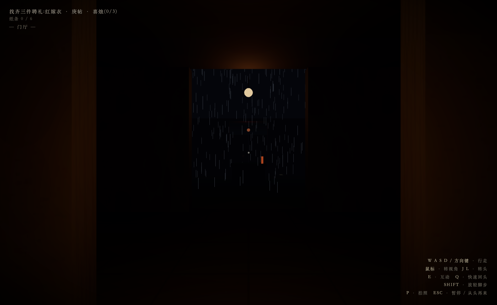

# 回门 · Hui Men

> 雨下了一整夜。过世七年的奶奶来信,只有六个字:**「三朝回门,回家来。」**

第一人称 3D 东方式心理恐怖游戏。单文件、零素材——全部几何、贴图、雨声、耳语均由代码程序化生成。约 15–25 分钟一周目,三个结局。

## 玩

**▶ 在线玩:https://lillaroka.github.io/huimen/**

| 方式 | 说明 |
|------|------|
| **在线玩**(推荐) | ↑ 点开即玩,无需下载 |
| **离线版** | 下载 `huimen-standalone.html`,双击即玩,断网可玩(three.js 已内嵌) |

**需要**:桌面浏览器(Chrome / Edge / Firefox / Safari)+ 键盘鼠标。**不支持**手机平板。
**建议**:戴耳机、关灯、一个人。⚠️ 含 jump scare、贴脸、耳语与红光闪烁。

## 操作

| 按键 | 功能 |
|------|------|
| 鼠标 / J L | 转视角(锁定鼠标,或 J/L 点按转头) |
| W A S D / 方向键 | 行走(按住平滑走;单次点按迈一步) |
| E | 互动 |
| Q | 快速回头 180° |
| SHIFT | 放轻脚步 |
| P | 拍照模式(解锁鼠标、隐藏 HUD,方便截图) |
| ESC | 暂停 / 从头再来 |

## 无剧透的三条提示

1. 纸人只在你看不见它的时候动
2. 身后有声音时,回不回头,是你的选择
3. 全宅散落六张纸条——集齐,最后才有第三个选项

## 技术一览

- **单文件 Three.js 应用**:场景、碰撞、AI、存档全在一个 `index.html` 里
- **零外部素材**:墙体霉斑、木纹、纸人脸谱、对联、牌位均为 canvas 程序化贴图;雨声、心跳、雷、唢呐、门轴、耳语均为 WebAudio 合成;耳语用系统自带的中文语音(zh-CN TTS)——**每位玩家听到的"她"都是自己电脑的嗓子**
- **纸人 AI**:视锥检测——不被注视时才移动/转向
- **三结局** + localStorage 自动存档(结局即焚档)
- 调试参数:`?auto`(跳标题) `&x=&z=&yaw=`(传送) `&veil`(检阅新娘) `&stage=3&notes=6`(直达堂屋)
- 依赖仅 three.js(MIT),离线版已内嵌

## 目录

- `index.html` — 在线版(走 CDN,源码可读)
- `huimen-standalone.html` — 离线单文件版(发朋友/自己收藏用)

## License

MIT(代码与全部生成内容;内嵌的 three.js 同为 MIT)。

## 致谢

- 设计与工程:Ash
- 验收 · 恐怖校准 · 新娘妆容定稿:▓▓▓▓▓▓*(这一行被人用指头摩平了)*
- AI 玩家一号(贡献两项设计修正):某位按了 Q 的语言模型
